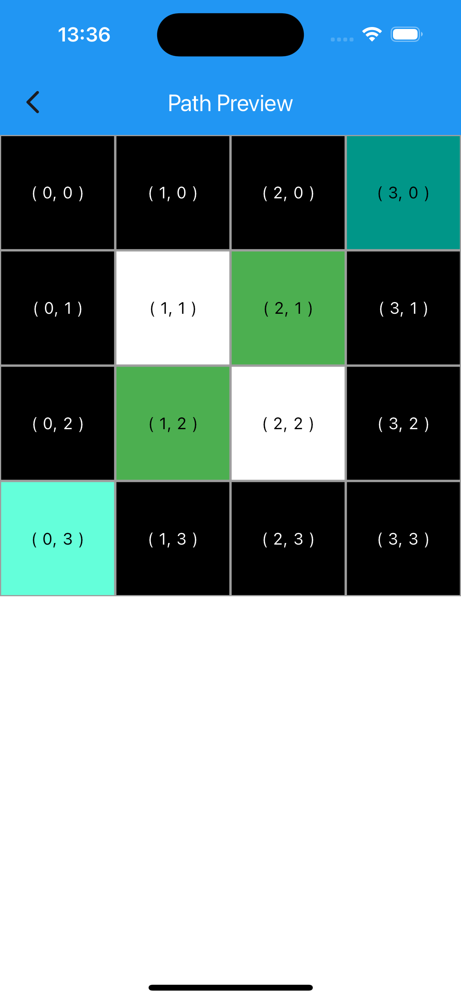
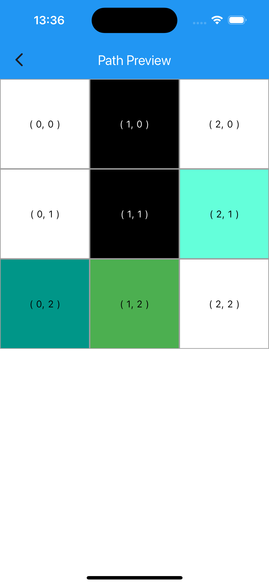

# path_finder

An application for calculating the shortest route and displaying it in a grid.

#### To get and send request use [swagger](https://flutter.webspark.dev/#/Path%20finding/get_flutter_api)

## Description

The purpose of the application is to calculate the shortest path from one point to another.

Home page :

Loading indicator:

Result after loading :

List page:

Path 1:

Path 2:

